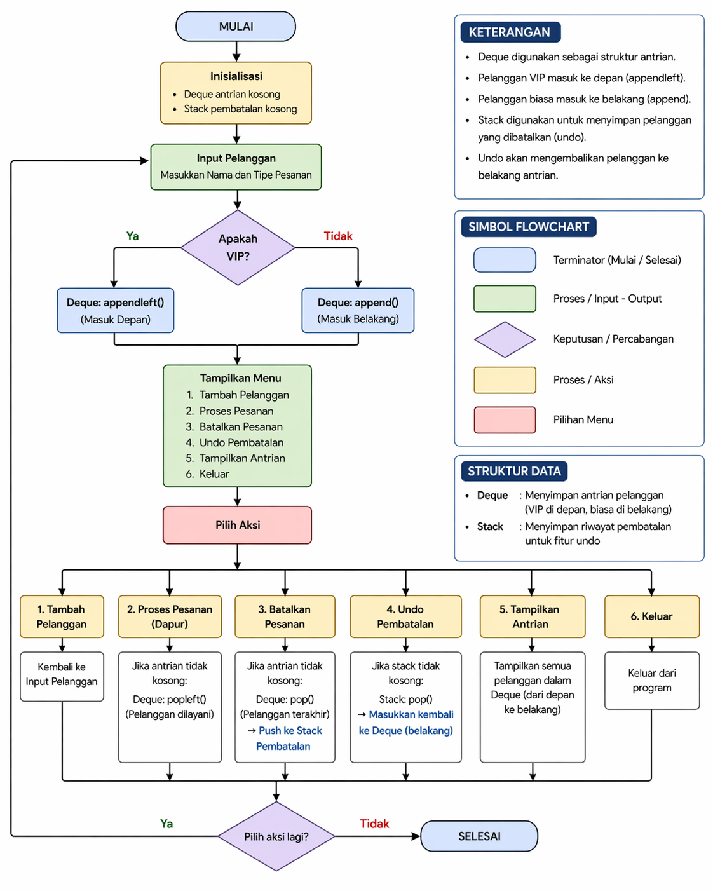

# Sistem Layanan Restoran Cepat Saji

## Deskripsi
Program ini mensimulasikan sistem antrian restoran menggunakan Queue, Deque, dan Stack.

## Algoritma

1. Mulai
2. Inisialisasi:
   - Buat deque untuk antrian
   - Buat stack untuk pembatalan
3. Tampilkan menu:
   - Tambah pelanggan
   - Proses pesanan
   - Batalkan pesanan
   - Undo pembatalan
   - Tampilkan antrian
   - Keluar
4. Jika tambah pelanggan:
   - Input nama & tipe
   - VIP → depan
   - Biasa → belakang
5. Jika proses pesanan:
   - Ambil dari depan
6. Jika batalkan:
   - Ambil dari belakang → simpan ke stack
7. Jika undo:
   - Ambil dari stack → masukkan ke antrian
8. Selesai

## Flowchart

